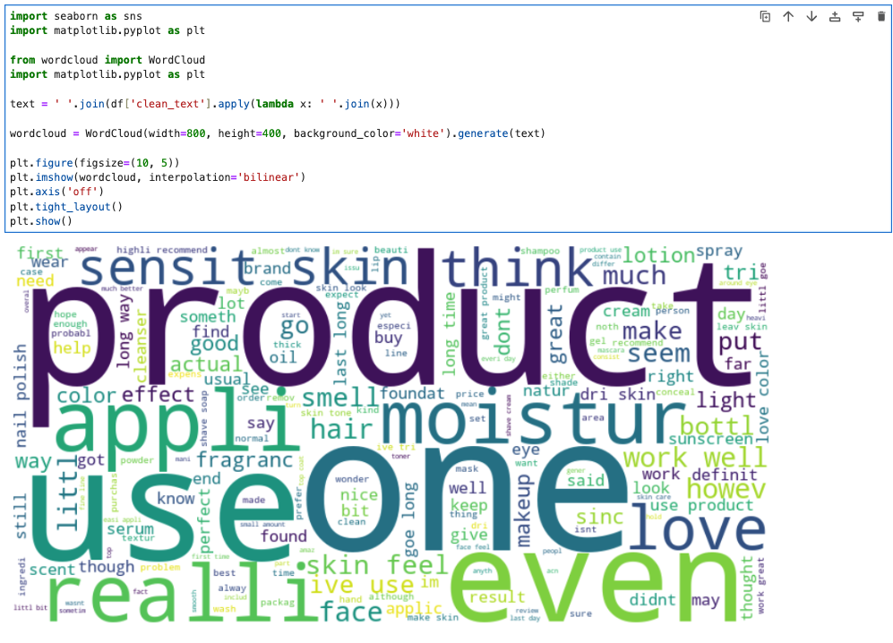
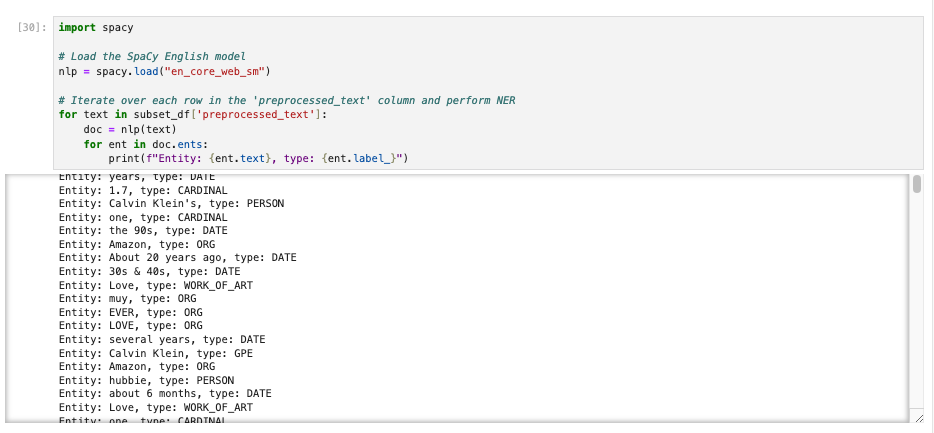
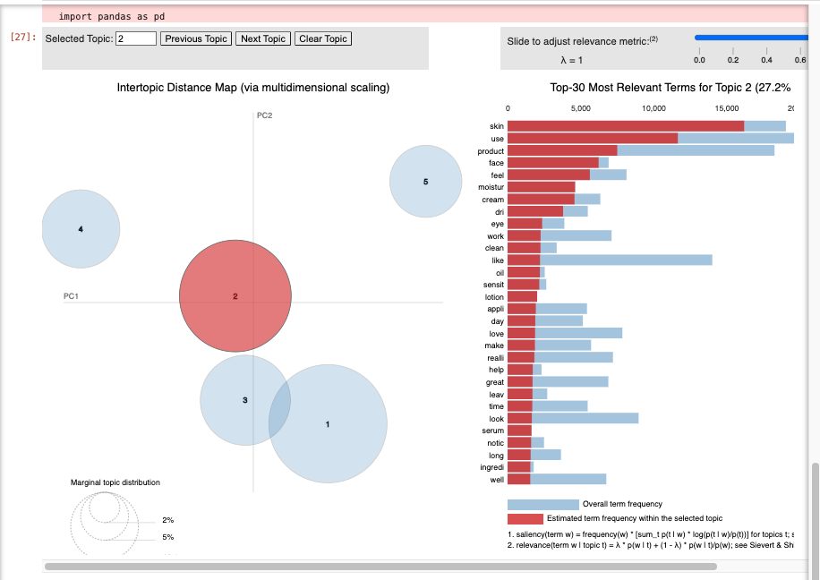

# 💄 Amazon Luxury Beauty Reviews - Natural Language Processing (NLP) Analysis

An end-to-end **Natural Language Processing (NLP)** project analysing Amazon **Luxury Beauty** customer reviews. This project demonstrates how unstructured customer feedback can be transformed into meaningful business insights through text preprocessing, sentiment analysis, Named Entity Recognition (NER), and topic modelling.

---

## 🚀 Project Overview

Customer reviews contain valuable insights into product quality, customer satisfaction, and purchasing behaviour. This project applies multiple NLP techniques to thousands of Amazon Luxury Beauty reviews to answer key business questions:

- What overall sentiment do customers express?
- Which words and product features appear most frequently?
- Which brands, products, and entities are commonly mentioned?
- What major discussion topics emerge from customer reviews?

The project demonstrates a complete NLP workflow, transforming raw review text into actionable business insights.

---

## 📂 Dataset

**Source:** Amazon Review Dataset (UCSD)

https://cseweb.ucsd.edu/~jmcauley/datasets/amazon_v2/

### Dataset Used

- **Luxury_Beauty_5.json.gz**
- Amazon Luxury Beauty Reviews
- Review period: **May 1996 – October 2018**

Luxury Beauty was selected because premium products generally have higher profit margins, making customer sentiment and brand perception especially valuable for business decision-making.

---

## 🛠️ Tech Stack & Libraries

**Language**

- Python

**Libraries**

- Pandas
- NumPy
- NLTK
- TextBlob
- SpaCy
- Scikit-learn
- WordCloud
- Matplotlib
- pyLDAvis

---

## 🧹 NLP Pipeline

The project follows the workflow below:

```text
Amazon Review Dataset
        │
        ▼
Dataset Preparation
        │
        ▼
Text Preprocessing
        │
        ▼
Vocabulary Building
        │
        ▼
Word Cloud Visualization
        │
        ▼
Sentiment Analysis
        │
        ▼
Named Entity Recognition (NER)
        │
        ▼
Topic Modelling (LDA)
        │
        ▼
Business Insights
```

---

## 📈 Key Findings & Visualizations

### 1. Vocabulary Analysis

Customer reviews were cleaned using tokenization, stopword removal, stemming, and lemmatization before constructing a vocabulary.

A **WordCloud** provides an overview of the most frequently occurring words across Luxury Beauty reviews, highlighting common products, customer experiences, and recurring discussion themes.



---

### 2. Sentiment Analysis

Customer sentiment was evaluated using **TextBlob**, assigning each review a polarity score between **-1** (negative) and **+1** (positive).

**Key observations:**

- Most reviews exhibit positive sentiment.
- Negative reviews make up a relatively small proportion of the dataset.
- Textual sentiment generally aligns with customer star ratings.

The histogram below illustrates the distribution of sentiment scores across all customer reviews.


---

### 3. Named Entity Recognition (NER)

Named Entity Recognition was performed using **SpaCy's** pretrained English model (`en_core_web_sm`).

Entities extracted include:

- Organizations
- Products
- People
- Locations
- Dates
- Quantities
- Monetary values

NER converts unstructured reviews into structured information, making it easier to identify frequently mentioned brands, products, and other important entities.



---

### 4. Topic Modelling

Latent Dirichlet Allocation (**LDA**) was applied to discover hidden discussion topics across thousands of customer reviews.

The modelling process involved:

- Creating a document-term matrix using `CountVectorizer`
- Training an LDA model with **5 topics**
- Assigning each review to its dominant topic
- Extracting representative keywords for every topic

The resulting **pyLDAvis** visualization illustrates topic separation and keyword importance.



**Interactive version:** Open `lda_visualization.html` locally to explore the interactive visualization.

---

## 💡 Business Insights

The NLP pipeline provides several valuable business insights, including:

- Overall customer sentiment towards Luxury Beauty products
- Agreement between review sentiment and customer ratings
- Frequently discussed product features
- Important named entities such as brands and organizations
- Hidden discussion topics extracted from thousands of customer reviews

These insights can help businesses:

- Improve product quality
- Monitor customer satisfaction
- Better understand customer preferences
- Enhance marketing strategies
- Support data-driven business decisions

---

## 📁 Project Structure

```text
├── Luxury_Beauty_5.json.gz
├── NLP_Project.ipynb
├── README.md
├── wordcloud.png
├── sentiment_histogram.png
├── ner_visualization.png
├── lda_visualization.png
└── lda_visualization.html
```

---

## 📚 Sample Libraries Used

```python
import pandas as pd
import numpy as np
import nltk
import spacy
from textblob import TextBlob
from wordcloud import WordCloud
from sklearn.feature_extraction.text import CountVectorizer
from sklearn.decomposition import LatentDirichletAllocation
import pyLDAvis
```

---

## 🎯 Key Learning Outcomes

Through this project, I gained practical experience in:

- Building an end-to-end NLP pipeline
- Cleaning and preprocessing large text datasets
- Performing sentiment analysis using TextBlob
- Applying Named Entity Recognition using SpaCy
- Discovering hidden topics using LDA topic modelling
- Visualizing NLP outputs using WordCloud, Matplotlib, and pyLDAvis
- Transforming unstructured customer reviews into actionable business insights

---

## 🚀 Future Improvements

Potential future enhancements include:

- Applying transformer-based sentiment models (e.g., BERT or RoBERTa)
- Performing aspect-based sentiment analysis
- Fine-tuning SpaCy's NER model for e-commerce-specific entities
- Comparing alternative topic modelling techniques such as BERTopic and NMF
- Building an interactive dashboard using Streamlit or Dash

---

## 👤 Author

This project was completed as part of a Natural Language Processing (NLP) coursework assignment, demonstrating the practical application of NLP techniques to real-world Amazon customer review data.
